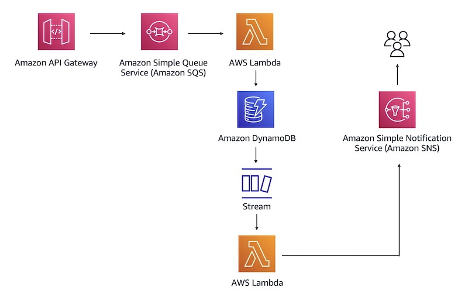

# E-Commerce Serverless Architecture Proof of Concept

## Overview
This proof of concept demonstrates a serverless architecture for an e-commerce web backend using AWS Lambda, API Gateway, SQS, DynamoDB, DynamoDB Streams, and SNS. The implementation focuses on using CloudFormation for infrastructure provisioning and AWS CLI for deployment and management.

## Business Context
An e-commerce company selling cleaning supplies needs a serverless web backend that can easily scale in and out as demand changes. The company experiences frequent spikes in demand and requires an architecture with decoupled application components.

## Architecture
The architecture follows this flow:
1. REST API (API Gateway) places a database entry in an SQS queue
2. SQS invokes the first Lambda function (POC-Lambda-1)
3. Lambda function inserts the entry into a DynamoDB table
4. DynamoDB Streams captures the new entry and invokes a second Lambda function (POC-Lambda-2)
5. The second Lambda function passes the database entry to SNS
6. SNS sends a notification to the specified email address



## Directory Structure
```
poc-1-serverless-architecture/
├── docs/                       # Documentation
│   └── images/                 # Architecture diagrams and screenshots
├── infrastructure/             # Infrastructure as Code
│   ├── cloudformation/         # CloudFormation templates
│   │   ├── main.yaml           # Main stack template
│   │   ├── iam.yaml            # IAM policies and roles
│   │   ├── api-gateway.yaml    # API Gateway resources
│   │   ├── sqs.yaml            # SQS queue resources
│   │   ├── lambda.yaml         # Lambda functions resources with embedded code
│   │   ├── dynamodb.yaml       # DynamoDB table and streams
│   │   └── sns.yaml            # SNS topic and subscriptions
│   └── scripts/                # Deployment and utility scripts
└── README.md                   # This file
```

> **Note:** The Lambda function code is embedded directly in the CloudFormation templates rather than being stored in separate files.

## Implementation Plan

1. Set up IAM policies and roles
   - Create CloudFormation templates for IAM policies and roles
   - Define policies for Lambda-SQS-DynamoDB role and Lambda-DynamoDB-SNS role
   - Implement least privilege access for each service

2. Create DynamoDB table
   - Create CloudFormation template for DynamoDB table
   - Configure primary key and capacity settings
   - Enable DynamoDB Streams for capturing table modifications

3. Set up SQS queue
   - Create CloudFormation template for SQS queue
   - Configure queue settings and permissions
   - Set up dead-letter queue for error handling

4. Implement first Lambda function (POC-Lambda-1)
   - Create CloudFormation template for Lambda function
   - Implement function code to process SQS messages and write to DynamoDB
   - Configure SQS as trigger for the Lambda function
   - Add proper error handling and logging

5. Enable DynamoDB Streams
   - Configure DynamoDB Streams in CloudFormation template
   - Set up stream to capture item-level changes

6. Create SNS topic and subscription
   - Create CloudFormation template for SNS topic
   - Configure email subscription for notifications
   - Set up appropriate access policies

7. Implement second Lambda function (POC-Lambda-2)
   - Create CloudFormation template for second Lambda function
   - Implement function code to process DynamoDB stream events and publish to SNS
   - Configure DynamoDB Streams as trigger for the Lambda function
   - Add proper error handling and logging

8. Create API Gateway REST API
   - Create CloudFormation template for API Gateway
   - Configure API resources, methods, and integration with SQS
   - Set up appropriate request/response mappings
   - Deploy API to a stage

## Deployment and Teardown Instructions

### Prerequisites
- AWS CLI installed and configured with appropriate credentials
- PowerShell (pwsh) installed
- S3 bucket name for CloudFormation templates (bucket will be created automatically if it doesn't exist)
- Email address for SNS notifications

### Deployment

This project includes a comprehensive PowerShell deployment script that handles all aspects of deploying the infrastructure. You can deploy the entire stack or individual components.

#### Deploy the Entire Stack

```powershell
# Navigate to the scripts directory
cd infrastructure/scripts

# Deploy all components
./deploy.ps1 -Environment dev -EmailAddress your-email@example.com -S3BucketName your-bucket-name -Component all -RunTests $true
```

#### Deploy Individual Components

You can deploy specific components by changing the `-Component` parameter:

```powershell
# Deploy only IAM resources
./deploy.ps1 -Environment dev -EmailAddress your-email@example.com -S3BucketName your-bucket-name -Component iam

# Deploy only DynamoDB
./deploy.ps1 -Environment dev -EmailAddress your-email@example.com -S3BucketName your-bucket-name -Component dynamodb

# Deploy only SQS
./deploy.ps1 -Environment dev -EmailAddress your-email@example.com -S3BucketName your-bucket-name -Component sqs

# Deploy only Lambda functions
./deploy.ps1 -Environment dev -EmailAddress your-email@example.com -S3BucketName your-bucket-name -Component lambda

# Deploy only SNS
./deploy.ps1 -Environment dev -EmailAddress your-email@example.com -S3BucketName your-bucket-name -Component sns

# Deploy only API Gateway
./deploy.ps1 -Environment dev -EmailAddress your-email@example.com -S3BucketName your-bucket-name -Component api-gateway
```

#### Deployment Parameters

| Parameter | Description | Required | Default |
|-----------|-------------|----------|--------|
| Environment | Deployment environment (dev, test, prod) | Yes | - |
| EmailAddress | Email address for SNS notifications | Yes | - |
| S3BucketName | S3 bucket for CloudFormation templates | Yes | - |
| Component | Component to deploy (all, iam, dynamodb, sqs, lambda, sns, api-gateway) | No | all |
| RunTests | Whether to run tests after deployment | No | $true |

### Teardown

To remove the deployed infrastructure, use the teardown script:

```powershell
# Navigate to the scripts directory
cd infrastructure/scripts

# Remove all components
./teardown.ps1 -Environment dev -Force $false
```

The script will list all stacks that will be deleted and prompt for confirmation unless `-Force $true` is specified.

#### Teardown Parameters

| Parameter | Description | Required | Default |
|-----------|-------------|----------|--------|
| Environment | Environment name (dev, test, prod) | No | dev |
| StackNamePrefix | Prefix used for all stack names | No | poc |
| Region | AWS region where stacks are deployed | No | us-east-1 |
| Force | Skip confirmation prompt | No | $false |
| Component | Component to delete (all, iam, dynamodb, sqs, lambda, sns, api-gateway, main) | No | all |

## Architecture Diagram

The architecture diagram is available in the `docs/images/` directory. It visualizes the flow of data through the serverless architecture:

1. Client sends request to API Gateway
2. API Gateway places message in SQS queue
3. SQS triggers Lambda function 1 (POC-Lambda-1)
4. Lambda function 1 writes data to DynamoDB
5. DynamoDB Streams captures the change and triggers Lambda function 2 (POC-Lambda-2)
6. Lambda function 2 publishes message to SNS topic
7. SNS sends email notification to subscribed email address

## Testing

### Testing the API Gateway

1. Get the API Gateway URL:
```bash
aws cloudformation describe-stacks \
  --stack-name ecommerce-serverless-poc-api \
  --query "Stacks[0].Outputs[?OutputKey=='ApiEndpoint'].OutputValue" \
  --output text
```

2. Send a test request to the API:
```bash
curl -X POST \
  -H "Content-Type: application/json" \
  -d '{"productId": "12345", "productName": "Eco-Friendly Cleaner", "quantity": 2, "customerEmail": "customer@example.com"}' \
  https://your-api-id.execute-api.us-east-1.amazonaws.com/dev/orders
```

### Verifying the Flow

1. Check SQS queue for messages:
```bash
aws sqs get-queue-attributes \
  --queue-url https://sqs.us-east-1.amazonaws.com/your-account-id/ecommerce-orders-queue \
  --attribute-names ApproximateNumberOfMessages
```

2. Check DynamoDB for inserted items:
```bash
aws dynamodb scan \
  --table-name ecommerce-orders
```

3. Verify email notification received at the subscribed email address.
