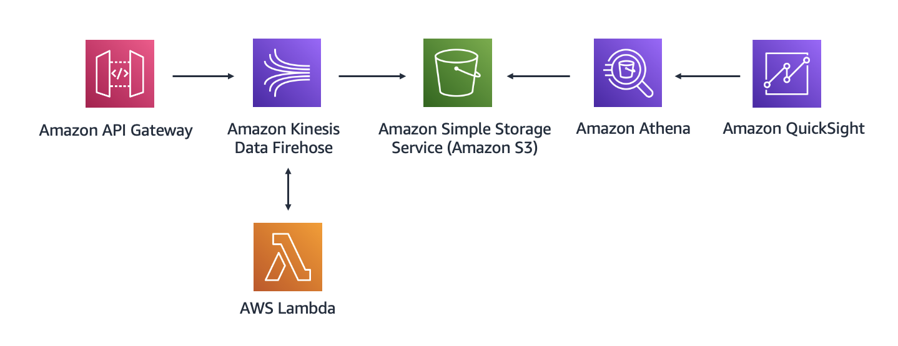

# Data Analytics Proof of Concept

## Overview
This proof of concept demonstrates a data analytics solution for ingesting, storing, and visualizing clickstream data using AWS managed services. The implementation focuses on using CloudFormation for infrastructure provisioning and AWS CLI for deployment and management.

## Business Context
A restaurant owner needs an analytics solution to derive insights from clickstream data related to menu items ordered in their restaurant. With limited staff for running and maintaining the solution, this POC leverages fully managed AWS services to minimize operational overhead.

## Architecture
The architecture follows this flow:
1. Amazon API Gateway ingests clickstream data
2. AWS Lambda transforms the data
3. Amazon Kinesis Data Firehose delivers the data to Amazon S3
4. Amazon Athena queries the data stored in S3
5. Amazon QuickSight visualizes the data through dashboards



## Directory Structure
```
poc-2-data-analytics/
├── docs/                       # Documentation
│   └── images/                 # Architecture diagrams and screenshots
├── infrastructure/             # Infrastructure as Code
│   ├── cloudformation/         # CloudFormation templates
│   │   ├── iam.yaml            # IAM policies and roles
│   │   ├── api-gateway.yaml    # API Gateway resources
│   │   ├── lambda.yaml         # Lambda function resources with embedded code
│   │   ├── firehose.yaml       # Kinesis Data Firehose resources
│   │   ├── s3.yaml             # S3 bucket resources
│   │   └── athena.yaml         # Athena resources
│   └── scripts/                # Deployment and utility scripts
└── README.md                   # This file
```

## Implementation Plan

1. Set up IAM policies and roles
   - Create CloudFormation templates for IAM policies and roles
   - Define policies for Lambda, Kinesis Data Firehose, S3, and Athena
   - Implement least privilege access for each service

2. Create S3 bucket for data storage
   - Create CloudFormation template for S3 bucket
   - Configure bucket policies and lifecycle rules
   - Set up appropriate partitioning structure for efficient querying

3. Create Lambda function for data transformation
   - Create CloudFormation template for Lambda function
   - Implement function code to transform clickstream data
   - Add proper error handling and logging

4. Set up Kinesis Data Firehose delivery stream
   - Create CloudFormation template for Firehose delivery stream
   - Configure S3 as the destination
   - Set up data transformation using Lambda

5. Create API Gateway REST API
   - Create CloudFormation template for API Gateway
   - Configure API resources, methods, and integration with Lambda
   - Set up appropriate request/response mappings
   - Deploy API to a stage

6. Create Athena table and queries
   - Create CloudFormation template for Athena resources
   - Define table schema for clickstream data
   - Create sample queries for common analytics use cases

7. Set up QuickSight dashboards (manual step)
   - Connect QuickSight to Athena
   - Create datasets based on Athena queries
   - Design visualizations and dashboards

## Deployment and Teardown Instructions

### Prerequisites
- AWS CLI installed and configured with appropriate credentials
- PowerShell (pwsh) installed
- S3 bucket for CloudFormation templates

### Deployment

This project includes a comprehensive PowerShell deployment script that handles all aspects of deploying the infrastructure. You can deploy the entire stack or individual components.

#### Deploy the Entire Stack

```powershell
# Navigate to the scripts directory
cd infrastructure/scripts

# Deploy all components
./deploy.ps1 -Environment dev -S3BucketName your-cf-templates-bucket -Component all -RunTests $true
```

#### Deploy Individual Components

You can deploy specific components by changing the `-Component` parameter:

```powershell
# Deploy only IAM resources
./deploy.ps1 -Environment dev -S3BucketName your-cf-templates-bucket -Component iam

# Deploy only S3
./deploy.ps1 -Environment dev -S3BucketName your-cf-templates-bucket -Component s3

# Deploy only Lambda functions
./deploy.ps1 -Environment dev -S3BucketName your-cf-templates-bucket -Component lambda

# Deploy only Firehose
./deploy.ps1 -Environment dev -S3BucketName your-cf-templates-bucket -Component firehose

# Deploy only API Gateway
./deploy.ps1 -Environment dev -S3BucketName your-cf-templates-bucket -Component api-gateway

# Deploy only Athena resources
./deploy.ps1 -Environment dev -S3BucketName your-cf-templates-bucket -Component athena

# Setup QuickSight resources
./deploy.ps1 -Environment dev -S3BucketName your-cf-templates-bucket -Component quicksight
```

#### Deployment Parameters

| Parameter | Description | Required | Default |
|-----------|-------------|----------|--------|
| Environment | Deployment environment (dev, test, prod) | Yes | - |
| S3BucketName | S3 bucket for CloudFormation templates | Yes | - |
| Component | Component to deploy (all, iam, s3, lambda, firehose, api-gateway, athena, quicksight) | No | all |
| RunTests | Whether to run tests after deployment | No | $true |
| SetupQuickSight | Generate QuickSight SQL queries and setup instructions | No | $false |

### Teardown

To remove the deployed infrastructure, use the enhanced teardown script:

```powershell
# Navigate to the scripts directory
cd infrastructure/scripts

# Remove all components with automatic S3 bucket emptying and verification
./teardown.ps1 -Environment dev -Force $false -EmptyS3Bucket $true -Verify $true
```

The script will:
1. Empty the S3 bucket (required for successful bucket deletion)
2. Delete all CloudFormation stacks in the correct order
3. Verify that all resources have been properly deleted
4. Provide instructions for QuickSight cleanup (which requires manual steps)

#### Teardown Parameters

| Parameter | Description | Required | Default |
|-----------|-------------|----------|--------|
| Environment | Deployment environment (dev, test, prod) | No | dev |
| StackNamePrefix | Prefix for CloudFormation stack names | No | poc2-data-analytics |
| Region | AWS region | No | us-east-1 |
| Force | Skip confirmation prompts | No | $false |
| Component | Component to remove (all, iam, s3, lambda, firehose, api-gateway, athena) | No | all |
| EmptyS3Bucket | Automatically empty S3 bucket before deletion | No | $true |
| Verify | Verify resource deletion after teardown | No | $true |
| ShowQuickSightInstructions | Show QuickSight cleanup instructions | No | $true |

### Deployment Process

The deployment script performs the following steps:

1. Creates or verifies the S3 bucket for CloudFormation templates
2. Deploys stacks in the correct order: IAM → S3 → Lambda → Firehose → API Gateway
3. Passes outputs from one stack as parameters to dependent stacks
4. Validates each stack deployment before proceeding
5. Runs infrastructure tests to verify all components are working correctly (if RunTests is true)

### Teardown Process

The teardown script:

1. Deletes CloudFormation stacks in reverse order to handle dependencies properly
2. Confirms stack deletion with the user before proceeding (unless Force is set)
3. Provides detailed feedback on the deletion process
4. Warns about S3 bucket content that may need manual cleanup

## Athena Integration

### Overview

The POC includes an Amazon Athena integration that allows you to query the clickstream data stored in S3 using standard SQL. The Athena component creates:

1. An Athena WorkGroup dedicated to the data analytics POC
2. A table definition for the clickstream data with the following schema:
   ```sql
   CREATE EXTERNAL TABLE my_ingested_data (
     element_clicked STRING,
     time_spent INT,
     source_menu STRING,
     created_at STRING
   )
   PARTITIONED BY (
     datehour STRING
   )
   ```
3. Predefined SQL queries for data analysis

### Using Athena

After deploying the Athena component, you can query your data in several ways:

1. **AWS Console**: Navigate to the Athena console, select the `data-analytics-workgroup-{env}` workgroup, and run the predefined queries or create your own.

2. **AWS CLI**: Execute the predefined queries using the AWS CLI:
   ```powershell
   # Get the query ID for the select data query
   $selectQueryId = aws cloudformation describe-stacks --stack-name "poc2-data-analytics-athena" --query "Stacks[0].Outputs[?OutputKey=='SelectDataQueryId'].OutputValue" --output text --region us-east-1
   
   # Get the workgroup name
   $workGroupName = aws cloudformation describe-stacks --stack-name "poc2-data-analytics-athena" --query "Stacks[0].Outputs[?OutputKey=='AthenaWorkGroupName'].OutputValue" --output text --region us-east-1
   
   # Get the query string
   $queryString = aws athena get-named-query --named-query-id $selectQueryId --query "NamedQuery.QueryString" --output text --region us-east-1
   
   # Execute the query
   $queryExecutionId = aws athena start-query-execution --query-string $queryString --work-group $workGroupName --region us-east-1 --query "QueryExecutionId" --output text
   
   # Check query status
   aws athena get-query-execution --query-execution-id $queryExecutionId --region us-east-1
   
   # Get query results
   aws athena get-query-results --query-execution-id $queryExecutionId --region us-east-1
   ```

3. **Analytics Query**: The deployment also creates an analytics query that groups data by element_clicked and calculates statistics:
   ```sql
   SELECT 
     element_clicked, 
     COUNT(*) as view_count, 
     AVG(time_spent) as avg_time_spent,
     MIN(time_spent) as min_time_spent,
     MAX(time_spent) as max_time_spent
   FROM my_ingested_data
   GROUP BY element_clicked
   ORDER BY view_count DESC
   ```

### Partition Projection

The Athena table uses partition projection to efficiently query data organized by date and hour. The table properties are configured to automatically recognize partitions in the format `yyyy/MM/dd/HH` without having to manually add partitions.

## QuickSight Integration

### Overview

Amazon QuickSight can be used to create interactive visualizations and dashboards for the clickstream data stored in your S3 bucket and queried through Athena. This section provides step-by-step instructions for setting up QuickSight with your data analytics POC.

> **Note**: Amazon QuickSight is a subscription service. If you need to delete your QuickSight account after completing this POC, follow the instructions in the [Cleanup](#quicksight-cleanup) section.

### Setup Instructions

#### For New QuickSight Users

1. **Sign up for QuickSight**:
   - Open the [QuickSight service console](https://quicksight.aws.amazon.com/).
   - Choose **Sign up for QuickSight**.
   - Select **Enterprise** and click **Continue**.
   - Set up an account and choose **Finish**.

2. **Configure S3 and Athena Permissions**:
   - In the upper-right corner, open the user menu by choosing the user icon and then choose **Manage QuickSight**.
   - In the navigation pane, choose **Security & permissions** and in QuickSight access to AWS services, choose **Manage**.
   - Under Amazon S3, choose **Select S3 buckets**.
   - Select the bucket created by the POC CloudFormation stack.
   - Also select **Write permission for Athena Workgroup**.
   - Choose **Finish** and save your changes.

3. **Create a Dataset**:
   - Return to the QuickSight console.
   - In the **Analyses** tab, choose **New analysis**.
   - Choose **New dataset**.
   - Choose **Athena** and configure the following settings:
     - Data source name: `poc-clickstream`
     - Athena workgroup: Select the workgroup created by the POC (`data-analytics-workgroup-{env}`)
   - Choose **Create data source**.
   - In the **Choose your table** dialog box, select the `my_ingested_data` table, and choose **Select**.
   - In the **Finish dataset creation** dialog box, make sure that **Import to SPICE for quicker analytics** is selected, and choose **Visualize**.

#### For Existing QuickSight Users

1. **Configure S3 and Athena Permissions**:
   - Open the [QuickSight service console](https://quicksight.aws.amazon.com/).
   - In the upper-right corner, open the user menu by choosing the user icon and then choose **Manage QuickSight**.
   - In the navigation pane, choose **Security & permissions** and in QuickSight access to AWS services, choose **Manage**.
   - Under Amazon S3, choose **Select S3 buckets**.
   - Select the bucket created by the POC CloudFormation stack.
   - Also select **Write permission for Athena Workgroup**.
   - Choose **Finish** and save your changes.

2. **Create a Dataset**:
   - Return to the QuickSight console by choosing the QuickSight icon (in the upper-left area of the webpage).
   - Choose **New analysis**.
   - Choose **New dataset**.
   - Choose **Athena** and configure these settings:
     - Data source name: `poc-clickstream`
     - Athena workgroup: Select the workgroup created by the POC (`data-analytics-workgroup-{env}`)
   - Choose **Create data source**.
   - In the **Choose your table** dialog box, select `my_ingested_data` and choose **Select**.
   - In the **Finish dataset creation** dialog box, keep **Import to SPICE for quicker analytics** selected and choose **Visualize**.

### Creating Visualizations

Once your dataset is created, you can build various visualizations to analyze your clickstream data:

1. **Menu Item Popularity**:
   - Create a bar chart with `element_clicked` on the x-axis and count of records on the y-axis.
   - This shows which menu items are viewed most frequently.

2. **Time Spent Analysis**:
   - Create a box plot with `element_clicked` on the x-axis and `time_spent` on the y-axis.
   - This shows the distribution of time spent viewing each menu item.

3. **Source Menu Analysis**:
   - Create a pie chart with `source_menu` as the dimension.
   - This shows the distribution of views by menu type.

4. **Time Series Analysis**:
   - Create a line chart with `created_at` (parsed as date) on the x-axis and count of records on the y-axis.
   - This shows trends in menu item views over time.

5. **Dashboard Creation**:
   - Combine multiple visualizations into a dashboard.
   - Add filters to allow interactive exploration of the data.
   - Set up automatic refresh to keep the dashboard updated with new data.

### Sample Dashboard Configuration

Here's a sample configuration for a clickstream analytics dashboard:

1. **Dashboard Layout**:
   - Top section: KPIs showing total views, average time spent, and unique items viewed
   - Middle section: Bar chart of popular items and time spent distribution
   - Bottom section: Time series trend and source menu breakdown

2. **Interactive Filters**:
   - Date/time range selector
   - Source menu dropdown
   - Minimum time spent slider

3. **Scheduled Refresh**:
   - Set up hourly SPICE refreshes to keep data current

## Complete Resource Cleanup

To avoid incurring costs after completing this POC, follow these steps to delete all resources created during the deployment.

### Automated Cleanup

The teardown script will remove most AWS resources created by CloudFormation:

```powershell
# Navigate to the scripts directory
cd c:\Git\aws-proof-of-concepts\poc-2-data-analytics\infrastructure\scripts

# Run the teardown script with force option to skip confirmation prompts
.\teardown.ps1 -Environment dev -Force $true
```

This will delete the following CloudFormation stacks in the correct order:
- API Gateway stack
- Firehose stack
- Lambda stack
- Athena stack
- S3 stack
- IAM stack

### Manual Cleanup Steps

Some resources require manual cleanup:

#### 1. S3 Bucket Contents

Before CloudFormation can delete the S3 bucket, you must empty it manually:

```powershell
# Get the bucket name from the CloudFormation stack output
$bucketName = aws cloudformation describe-stacks --stack-name "poc2-data-analytics-s3" --query "Stacks[0].Outputs[?OutputKey=='BucketName'].OutputValue" --output text --region us-east-1

# Empty the bucket
aws s3 rm s3://$bucketName --recursive --region us-east-1
```

#### 2. QuickSight Resources

QuickSight resources must be deleted manually in the following order:

1. **Delete Analyses**:
   - Sign in to the [QuickSight console](https://quicksight.aws.amazon.com/)
   - Navigate to the **Analyses** tab
   - For each analysis, click the ellipsis (⋮) menu and select **Delete**
   - Confirm deletion when prompted

2. **Delete Dashboards**:
   - Navigate to the **Dashboards** tab
   - For each dashboard, click the ellipsis (⋮) menu and select **Delete**
   - Confirm deletion when prompted

3. **Delete Datasets**:
   - Navigate to the **Datasets** tab
   - For each dataset, click the ellipsis (⋮) menu and select **Delete**
   - Confirm deletion when prompted

4. **Delete Data Sources**:
   - Navigate to the **Datasets** tab
   - Click **New dataset**
   - For each data source, click the ellipsis (⋮) menu and select **Delete data source**
   - Confirm deletion when prompted

5. **Delete QuickSight Account** (optional):
   - Click your profile name in the top-right corner
   - Select **Manage QuickSight**
   - In the navigation pane, choose **Account settings**
   - Click **Delete account**
   - Follow the prompts to confirm deletion

> **Note**: Deleting your QuickSight account will remove all datasets, analyses, and dashboards you've created. Only do this if you don't plan to use QuickSight for other purposes.

#### 3. Athena Workgroup Query Results

If you've run Athena queries, the results may still be stored in S3:

```powershell
# Clean up Athena query results (adjust the bucket/prefix as needed)
aws s3 rm s3://$bucketName/athena-results/ --recursive --region us-east-1
```

### Verification

After completing all cleanup steps, verify that all resources have been deleted:

1. **CloudFormation Stacks**:
   ```powershell
   aws cloudformation list-stacks --stack-status-filter CREATE_COMPLETE UPDATE_COMPLETE --query "StackSummaries[?contains(StackName, 'poc2-data-analytics')].StackName" --output table --region us-east-1
   ```

2. **S3 Buckets**:
   ```powershell
   aws s3 ls | findstr "poc2-data-analytics"
   ```

3. **Lambda Functions**:
   ```powershell
   aws lambda list-functions --query "Functions[?contains(FunctionName, 'transform-data')].FunctionName" --output table --region us-east-1
   ```

4. **API Gateway**:
   ```powershell
   aws apigateway get-rest-apis --query "items[?contains(name, 'poc2-data-analytics')].name" --output table --region us-east-1
   ```

5. **Firehose Delivery Streams**:
   ```powershell
   aws firehose list-delivery-streams --query "DeliveryStreamNames[?contains(@, 'poc2-data-analytics')]" --output table --region us-east-1
   ```

6. **Athena Workgroups**:
   ```powershell
   aws athena list-work-groups --query "WorkGroups[?contains(Name, 'data-analytics-workgroup')].Name" --output table --region us-east-1
   ```

## Testing

### Automated Testing

The deployment script includes automated testing functionality that verifies the deployed infrastructure is working correctly. Tests are run automatically when the `-RunTests` parameter is set to `$true` (default).

The automated tests perform the following checks:

1. Verify all infrastructure components are deployed and accessible
2. Send test clickstream events to the API Gateway
3. Confirm successful HTTP 200 responses for each test payload
4. Check for data delivery to the S3 bucket
5. Verify Lambda function invocation and logs
6. Check Kinesis Firehose delivery stream status
7. Verify Athena WorkGroup exists and is accessible
8. Run a test query against the Athena table and report results

The automated tests run the following sample payloads against the API Gateway:

```json
// Entree 1 - Test 1
{
  "element_clicked": "entree_1",
  "time_spent": 67,
  "source_menu": "restaurant_name",
  "created_at": "2022-09-11 23:00:00"
}

// Entree 1 - Test 2
{
  "element_clicked": "entree_1",
  "time_spent": 12,
  "source_menu": "restaurant_name",
  "created_at": "2022-09-11 23:00:00"
}

// Entree 4
{
  "element_clicked": "entree_4",
  "time_spent": 32,
  "source_menu": "restaurant_name",
  "createdAt": "2022-09-11 23:00:00"
}

// Drink 1
{
  "element_clicked": "drink_1",
  "time_spent": 15,
  "source_menu": "restaurant_name",
  "created_at": "2022-09-11 23:00:00"
}

// Drink 3
{
  "element_clicked": "drink_3",
  "time_spent": 14,
  "source_menu": "restaurant_name",
  "created_at": "2022-09-11 23:00:00"
}
```

To run these tests as part of deployment:

```powershell
./deploy.ps1 -Environment dev -S3BucketName your-cf-templates-bucket -RunTests $true
```

### Manual Testing

#### Testing the API Gateway

1. Get the API Gateway URL:
```powershell
aws cloudformation describe-stacks --stack-name "poc2-data-analytics-api-gateway" --query "Stacks[0].Outputs[?OutputKey=='ClickstreamIngestAPIEndpoint'].OutputValue" --output text
```

2. Send a test clickstream event to the API:
```powershell
$payload = @{
    "element_clicked" = "entree_1"
    "time_spent" = 67
    "source_menu" = "restaurant_name"
    "created_at" = "2022-09-11 23:00:00"
} | ConvertTo-Json

Invoke-RestMethod -Method Post -Uri "https://your-api-id.execute-api.us-east-1.amazonaws.com/dev/poc" -Body $payload -ContentType "application/json"
```

### Verifying Data Flow

1. Check S3 for delivered data:
```powershell
aws s3 ls s3://poc2-data-analytics-kt/ --recursive
```

2. Check Lambda function logs:
```powershell
aws logs get-log-events --log-group-name "/aws/lambda/transform-data-dev" --log-stream-name "latest" --limit 10
```

## Architecture Diagram

The architecture diagram is available in the `docs/images/` directory. It visualizes the flow of data through the analytics pipeline:

1. Client sends clickstream data to API Gateway
2. API Gateway triggers Lambda function for transformation
3. Lambda function sends data to Kinesis Data Firehose
4. Firehose delivers data to S3 in optimized format
5. Athena queries data directly from S3
6. QuickSight creates visualizations from Athena queries

## References

- [AWS Documentation: Amazon Kinesis Data Firehose](https://docs.aws.amazon.com/firehose/latest/dev/what-is-this-service.html)
- [AWS Documentation: Amazon Athena](https://docs.aws.amazon.com/athena/latest/ug/what-is.html)
- [AWS Documentation: Amazon QuickSight](https://docs.aws.amazon.com/quicksight/latest/user/welcome.html)
