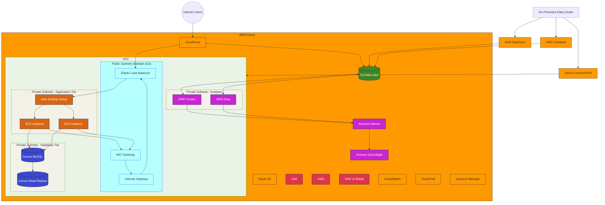

# AWS Migration Architecture Diagram (Mermaid)

Below is a Mermaid representation of the AWS migration architecture. Note that Mermaid doesn't support AWS-specific icons, so we're using standard shapes with labels.

## Notes on the Mermaid Diagram

1. This is a simplified representation. For a professional AWS architecture diagram, use the AWS Architecture Icons with a tool like diagrams.net.

2. The diagram shows:
   - Web application components (CloudFront, ELB, EC2, Aurora)
   - Data analytics components (EMR, Glue, Athena, QuickSight)
   - Data migration paths (DataSync, Snowball, Direct Connect)
   - Security and management services

3. For a complete diagram with proper AWS icons, use the instructions in the diagram-instructions.md file.

## Recommended Next Steps

1. Use diagrams.net with AWS Architecture Icons for a professional diagram
2. Add more details to show multi-AZ deployment
3. Include CI/CD pipeline components
4. Show data flow paths more explicitly
